  <div align="center">
    
  </div>

<div align="center"></div>

# <div align="center">TALKHEAL</div>

  <div align="center">
    
  </div>

## 🧠 Your AI-Powered Mental Health Companion

**TalkHeal** is an empathetic, intelligent, and interactive mental health support assistant. Built with **Python** and **Streamlit**, it provides a safe, non-judgmental space for users to track their emotional well-being, learn coping strategies, and access professional guidance when needed. It offers 24/7 support, emotional journaling, resource guidance, and AI-powered conversations powered by Google’s Gemini.

---

### Vision: A Compassionate Path to Mental Well-being

Mental health is a fundamental component of overall health and well-being, underpinning our ability to cope with life's stresses, realize our potential, and contribute to our communities. In today's fast-paced world, challenges such as economic downturns, social isolation, and rapid lifestyle changes can undermine mental health. Many people face serious conditions like depression and anxiety, which are increasingly common globally and can lead to significant distress and impairment in daily functioning.

The vision for TalkHeal is to address these challenges by providing accessible, precise, and personalized mental health support through the seamless integration of technology and human-centric design. We believe that every individual deserves a safe space to explore their emotions and access tools that empower their wellness journey. TalkHeal is more than just a chatbot; it is a holistic mental health companion designed to fill a crucial gap in care and support.

#### The TalkHeal Difference

* **Empathetic Conversations, Anytime, Anywhere**: Many people are reluctant to talk about their feelings due to stigma or embarrassment. TalkHeal offers a private, non-judgmental space where users can engage in supportive conversations 24/7. The ability to choose an AI personality—from a "Compassionate Listener" to a "Motivating Coach"—ensures that the interaction is tailored to what the user needs most at that moment. This personalized approach helps build trust and encourages users to be open and honest about their experiences.

* **Proactive Self-Management**: TalkHeal empowers users to take an active role in their well-being. The Mood Dashboard helps them identify patterns and triggers in their emotional life, providing insights that can inform healthier choices. Tools like the Focus Session, Breathing Exercises, and Yoga Recommendations offer practical coping strategies to manage stress, anxiety, and frustration in real-time. The goal is to move beyond simply reacting to distress and instead build psychological resilience and proactive wellness habits.

* **Connecting to Real-World Support**: While TalkHeal provides a valuable first step, it is not a substitute for professional care. Our vision includes acting as a bridge to professional help. The platform includes a Doctor Specialist Recommender to help users understand potential symptoms and find a suitable professional, as well as a Crisis Help page that provides immediate access to local and international hotlines in case of a mental health emergency. This two-pronged approach ensures that users are always supported, whether through our digital tools or by connecting with human professionals.

In essence, TalkHeal aims to destigmatize mental health, promote self-awareness, and make evidence-based support accessible to everyone. By integrating compassionate AI with a comprehensive toolkit of wellness resources, TalkHeal seeks to become a trusted companion on the journey toward a healthier and more balanced life.

---

## 🏗️ Architecture & Logic Flow
To help contributors understand how **TalkHeal** integrates AI, databases, and wellness tools, here is a breakdown of our internal logic.

### 🔄 User Interaction Lifecycle
This sequence shows how your message is processed through the chosen AI personality and logged for your mood history.

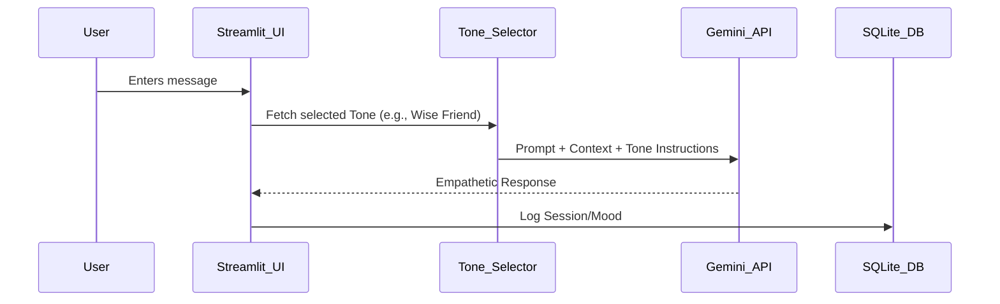

### 🧠 Intelligence Hub Routing
TalkHeal isn't just a chatbot; it's a wellness engine. Depending on your mood input, the system routes you to specific therapeutic tools.

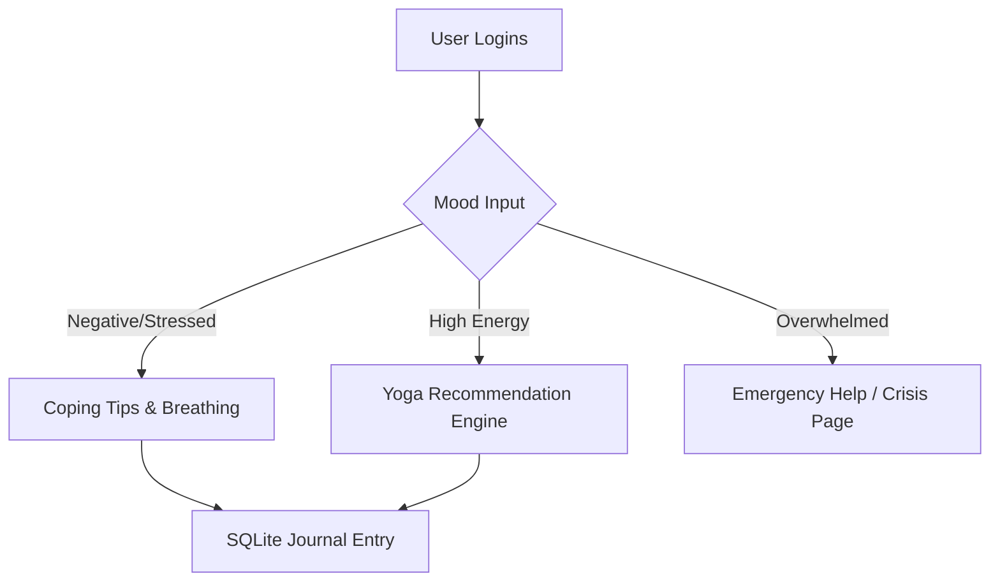

---

## 🚀 Live Demo
Experience TalkHeal live here: 

👉 [](https://TalkHeal.app/)

 <div align="center">
 <p>

[](https://github.com/ellerbrock/open-source-badges/)


 </p>
 </div>

<div align="center">
  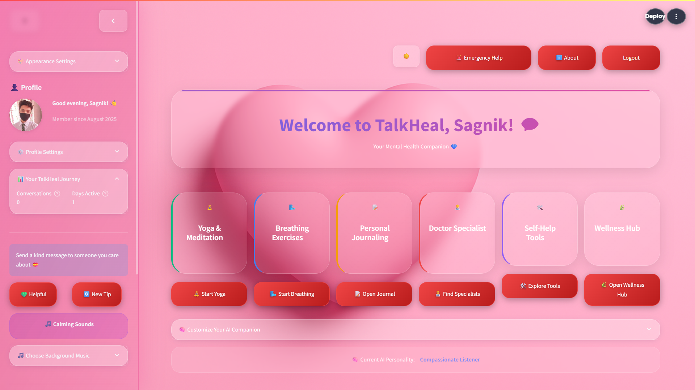
  <br>
</div>

---

## ✨ Features 
<div align="center">
  
</div>

### 🗣️ Conversational AI Support

* **Gemini-powered chatbot**: The core of the app is an AI companion built on **Google's Gemini** models (`gemini-2.5-pro` and `gemini-2.0-flash`).
* **Chatbot Personality Tone Selector**: You can personalize the AI's approach by choosing from five distinct tones: **Compassionate Listener**, **Motivating Coach**, **Wise Friend**, **Neutral Therapist**, and **Mindfulness Guide**.
* **Session Management**: The app allows you to create, title, and manage multiple chat sessions, which are saved in JSON files for persistence and privacy via IP-based isolation.
* **Session Feedback & Emotional Closure**: After a chat session, you can provide feedback on your experience and receive an emotional closure message.

<div align="center">
  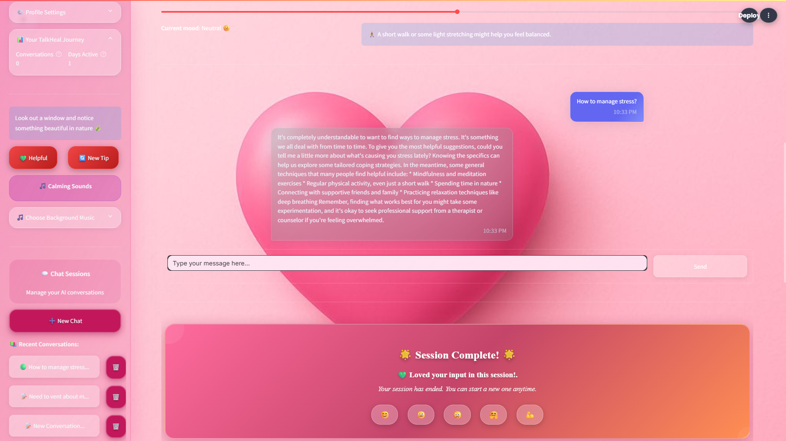
  <br>
</div>

### 💖 Mood Tracking, Journaling & Insights

* **Interactive Mood Dashboard**: Track your emotional state with a five-level mood scale and visualize your mood history, trends, and patterns over time with interactive charts. The dashboard analyses mood by day of the week, time of day, and common contexts or activities.
* **Personal Journaling**: Write and save private journal entries to a secure SQLite database. The app analyzes the sentiment of each entry (Positive, Neutral, Negative) and allows you to filter and review past thoughts.
* **AI-Assisted Coping Tips**: Based on your selected mood, the app provides instant coping tips and micro-journaling prompts to guide your reflection.

### 🧘 Self-Help & Wellness Tools

* **Yoga Recommendations**: An innovative tool that analyzes your emotional state and generates tailored yoga pose recommendations with step-by-step instructions in a structured JSON format.

<div align="center">
  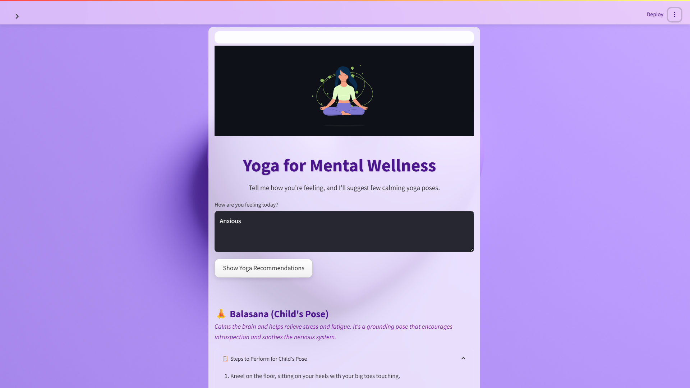
  <br>
</div>

* **Focus Sessions**: Use a customizable timer for a Pomodoro session or a mindful break. Sessions come with a visual breathing animation, motivational quotes, and optional calming background audio.

<div align="center">
  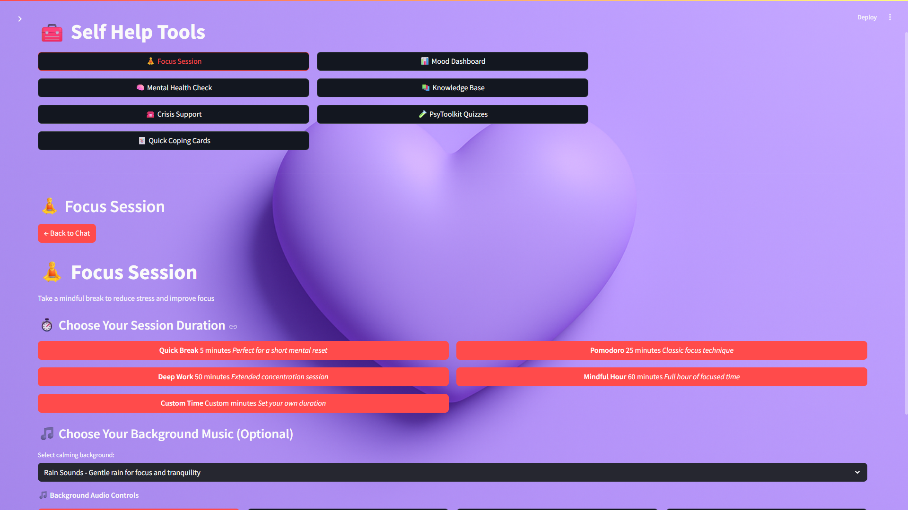
  <br>
</div>

* **Breathing Exercises**: A simple and guided exercise with a visual animation to help you relax and regulate your breathing.

<div align="center">
  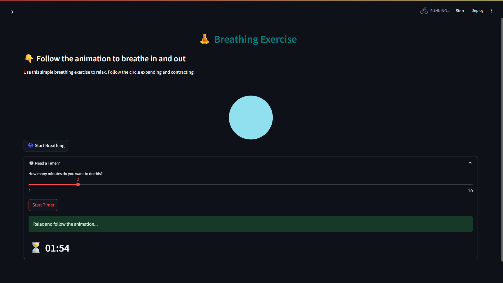
  <br>
</div>

* **Quick Coping Cards**: Instantly generate randomized coping strategies for grounding, mindfulness, movement, reflection, and creative expression. You can save your favorites for later use.

<div align="center">
  
  <br>
</div>

* **Wellness Hub**: A central hub providing simple wellness tips across five categories: Mind, Body, Nutrition, Sleep, and Stress Relief. It also includes a quick self-check, a daily planner, and a mood tracker.

<div align="center">
  
  <br>
</div>

### 📘 Resource & Crisis Help

* **Emergency Help**: An "Emergency Help" page provides immediate access to local crisis support by dynamically searching for resources based on your location. It also lists a comprehensive directory of global crisis hotlines.

<div align="center">
  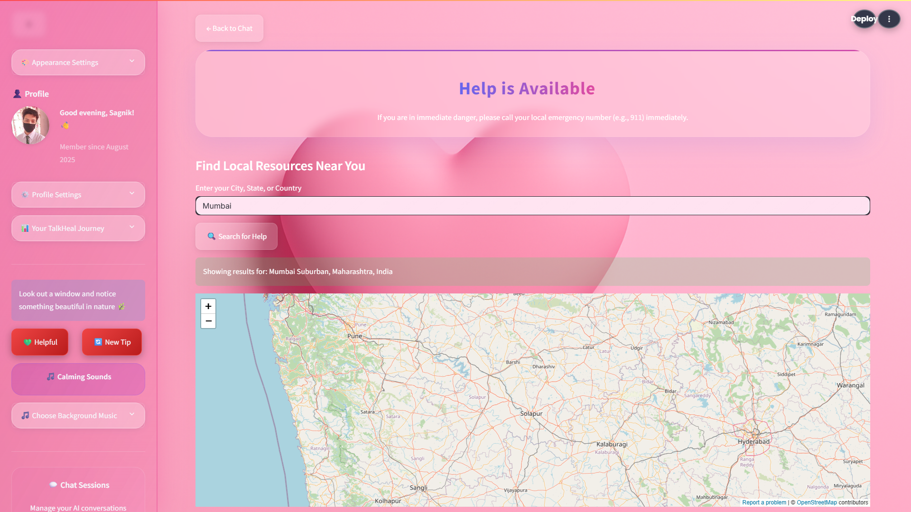
  <br>
</div>

* **Doctor Specialist Recommender**: This tool uses multiple machine learning models (e.g., Logistic Regression, SVM, Random Forest) to suggest potential diseases based on user-input symptoms and recommends a suitable medical specialist.

<div align="center">
  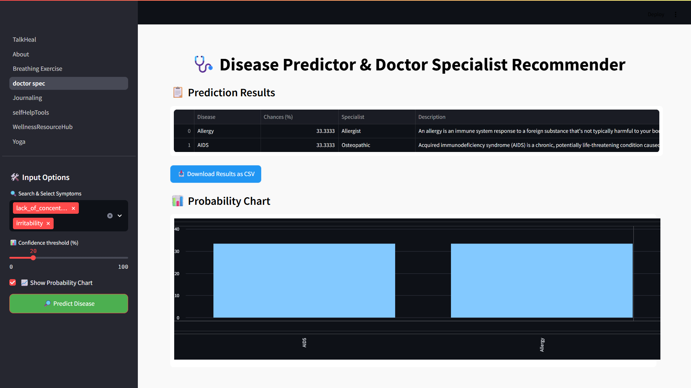
  <br>
</div>

* **Mental Health Quizzes**: Integrated PsyToolkit-verified quizzes (GAD-7, PHQ-9, WHO-5) for self-evaluation of anxiety, depression, and overall well-being.

<div align="center">
  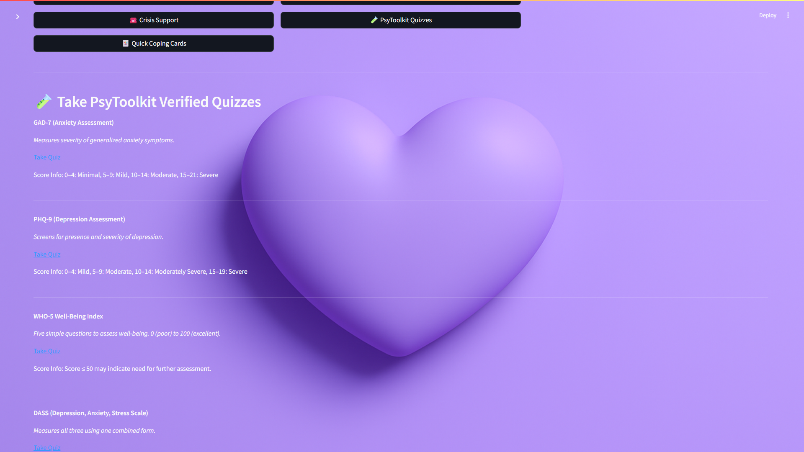
  <br>
</div>

### 🔐 Authentication & Security

* **Multiple Login Options**: Choose from traditional email/password authentication, OAuth with popular providers (Google, GitHub, Microsoft), or guest access.
* **OAuth Integration**: Secure social login with Google, GitHub, and Microsoft OAuth providers for quick and safe authentication.
* **Guest Mode**: Access core features without creating an account for immediate support.
* **Secure Session Management**: Robust session handling with CSRF protection and secure token management.

### 🎨 Themes & UI

* **Dynamic Theme System**: Choose from multiple soothing color palettes and switch between **Light** and **Dark** modes with a single click.
* **Glassmorphic Design**: The UI features a 3D-inspired glassmorphic style with blurred, translucent containers and smooth transitions for a visually calming experience.
* **Customizable User Profile**: Create a user profile with a name and profile picture, and set your preferred font size for the entire application.

<div align="center">
  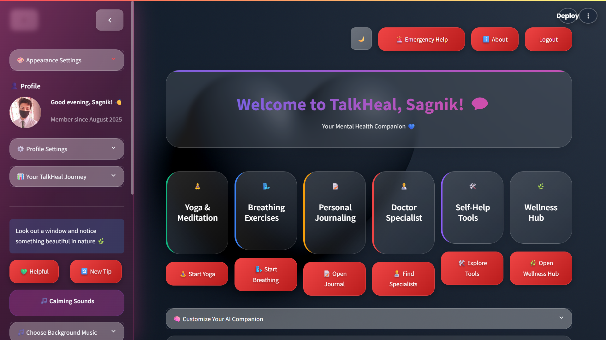</a>
  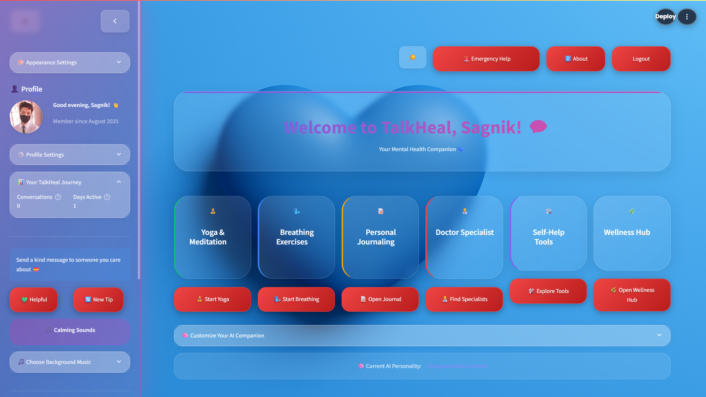</a>
  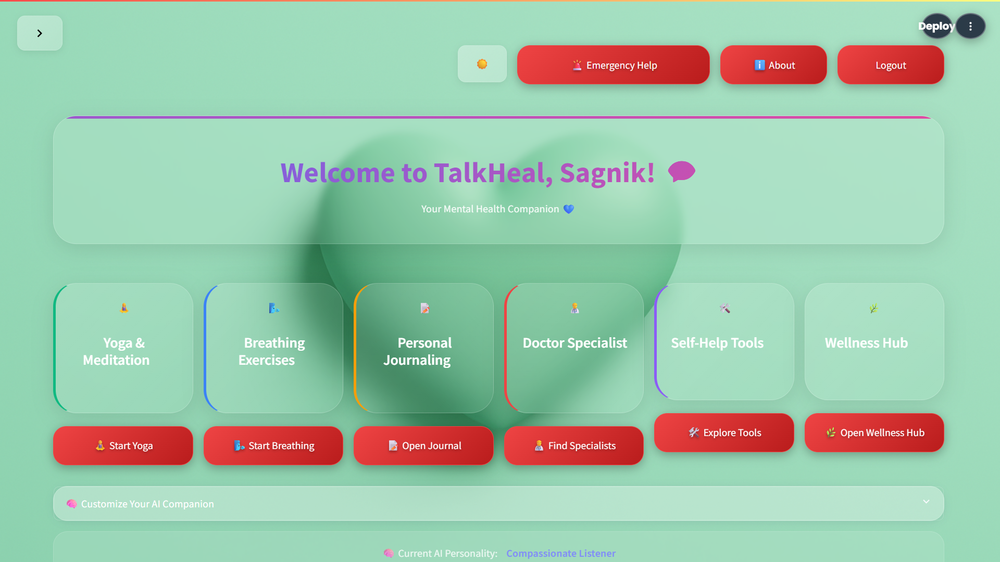</a>
</div>

---

## 🗄️ Database Setup

The application uses SQLite databases for user management and journaling. These databases are automatically created when you first run the application, but you can also set them up manually:

### Automatic Setup (Recommended)
The databases will be created automatically when you run the application for the first time.

### Manual Setup (Optional)
If you want to set up the databases manually, run:

```bash
python setup_database.py
```

This will create:
- `users.db` - User authentication and profile data
- `journals.db` - User journal entries and mood tracking data

**Note**: Database files (`.db`) are automatically ignored by git to prevent conflicts and protect user data.

---

## 📺 Video Explanation

For a detailed walkthrough of TalkHeal's features and how to use them, check out this video:

**[Video Coming Soon]**

---

## 📁 Project Structure

<details>
<summary><strong>🗂️ Click to view detailed project architecture</strong></summary>

```bash
TalkHeal/
├── .devcontainer/               # Dev container configuration (for VS Code)
├── .github/                     # GitHub workflows and issue templates
├── .streamlit/
│   └── secrets.toml             # Streamlit secrets (API keys, credentials)
├── assets/
│   ├── pink.png
│   └── yoga_animation.json
├── audio/
├── audio_files/
├── auth/
│   ├── auth_utils.py            # Authentication functions (login, register)
│   └── users.yaml               # User credentials and roles (YAML format)
├── components/
│   ├── Breathing_Exercise.py
│   ├── __init__.py
│   ├── chat_interface.py
│   ├── emergency_page.py
│   ├── focus_session.py
│   ├── header.py
│   ├── login_page.py
│   ├── mood_dashboard.py
│   ├── profile.py
│   ├── sidebar.py
│   └── theme_toggle.py
├── core/
│   ├── __init__.py
│   ├── config.py                # Central app configuration
│   ├── theme.py
│   └── utils.py                 # Common helper functions
├── css/
│   └── styles.py
├── data/
│   └── Yoga.json                # Yoga session data (poses, flows)
├── favicon/
│   ├── apple-touch-icon.png
│   ├── favicon-96x96.png
│   ├── favicon.ico
│   ├── favicon.svg
│   ├── site.webmanifest
│   ├── web-app-manifest-192x192.png
│   └── web-app-manifest-512x512.png
├── pages/
│   ├── About.py
│   ├── Journaling.py           # Journaling UI page
│   ├── Yoga.py                 # Yoga activity page
│   └── selfHelpTools.py        # Tools/resources for self-help
├── .env.example                 # Template for environment variables
├── .gitignore                   # Files/folders ignored by Git
├── Background.jpg
├── Background_Dark.jpg
├── CODE_OF_CONDUCT.md          # Contribution behavior guidelines
├── CONTRIBUTING.md             # Instructions for contributing
├── LICENSE                     # License for the project (e.g., MIT)
├── MOOD_TRACKING_README.md     # Info about the mood tracking feature
├── README.md                   # Main project documentation
├── TalkHeal.pptx               # Presentation for TalkHeal
├── TalkHeal.py                 # 🔷 Main app entry point (Streamlit)
├── TalkHealLogo.png
├── blue.png
├── blue_ss.jpg
├── dark.png
├── dark_ss.jpg
├── generate_audio.py           # Script to convert text to speech/audio
├── journals.db                 # Database of user journal entries
├── lav_ss.jpg
├── lavender.png
├── light_ss.jpg
├── mint.png
├── requirements.txt            # Python package dependencies
├── streamlit.toml              # Streamlit configuration
├── test_mood_dashboard.py      # Test cases for mood dashboard
└── users.db                    # Database for user authentication

```
</details>

---

## 🛠️ Technologies Used


---

## ⚙️ Installation and Setup

> Clone and run locally using Python and Streamlit.

1. **Clone the repository:**
   ```bash
   git clone https://github.com/eccentriccoder01/TalkHeal.git
   cd TalkHeal
   ```

2. **Install dependencies:**
   ```bash
   pip install -r requirements.txt
   ```
   > **Having installation issues?** Check our [Installation Troubleshooting Guide](INSTALLATION_TROUBLESHOOTING.md) for solutions to common problems like timeout errors, slow downloads, and network issues.

3. **Set up API key:**
   Go to your Streamlit [Secrets Settings](https://streamlit.io/cloud) and add:
   ```toml
   GEMINI_API_KEY = "YOUR_GOOGLE_GEMINI_API_KEY"
   ```

4. **Set up environment variables:**
   Copy the provided template and fill in your values:
   ```bash
   cp .env.example .env
   ```
   Then edit `.env` with your actual credentials (API keys, OAuth secrets, etc.).
   See [`.env.example`](.env.example) for all available options and setup links.
   
   For detailed OAuth setup instructions, see [OAUTH_SETUP.md](OAUTH_SETUP.md)

5. **Run the app:**
   ```bash
   streamlit run TalkHeal.py
   ```

6. **Test OAuth setup (Optional):**
   ```bash
   python test_oauth.py
   ```

---

## Issue Creation ✴
Report bugs and  issues or propose improvements through our GitHub repository.

---

## Contribution Guidelines 📑

<div align="center">
  
</div>

- Firstly Star(⭐) the Repository
- Fork the Repository and create a new branch for any updates/changes/issue you are working on.
- Start Coding and do changes.
- Commit your changes
- Create a Pull Request which will be reviewed and suggestions would be added to improve it.
- Add Screenshots and updated website links to help us understand what changes is all about.

- Check the [CONTRIBUTING.md](CONTRIBUTING.md) for detailed steps...

### Contributing is fun🧡

We welcome all contributions and suggestions!
Whether it's a new feature, design improvement, or a bug fix — your voice matters 💜

Your insights are invaluable to us. Reach out to us team for any inquiries, feedback, or concerns.

---

## 👥 Contributors

Thanks to these wonderful people for contributing 💖

[](https://github.com/eccentriccoder01/TalkHeal/graphs/contributors)

<p>
  <!-- Vaunt.dev (auto-updating SVG contributors graph) -->
  <a href="https://github.com/eccentriccoder01/talkheal/graphs/contributors">
    
  </a>
</p>

---

## 📄 License

This project is open-source and available under the [MIT License](LICENSE).

---

## 📞 Contact

Developed by [Eccentric Explorer](https://eccentriccoder01.github.io/Me)

Feel free to reach out with any questions or feedback\! Thanks for reading, here's a cookiepookie:


